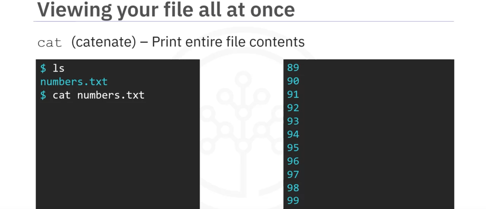
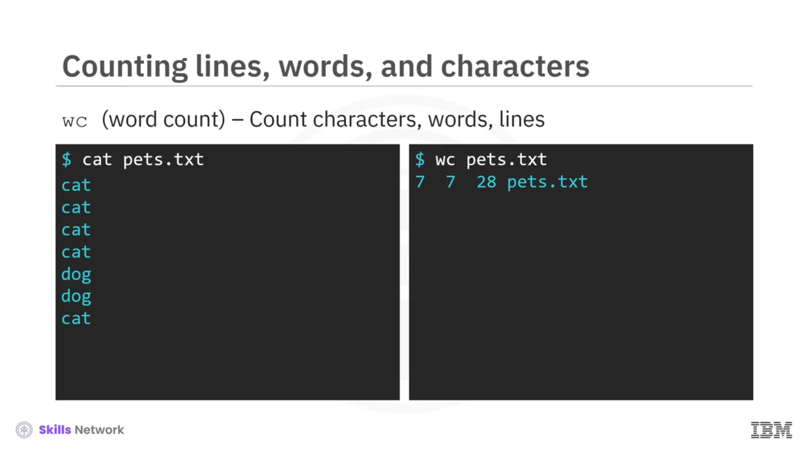
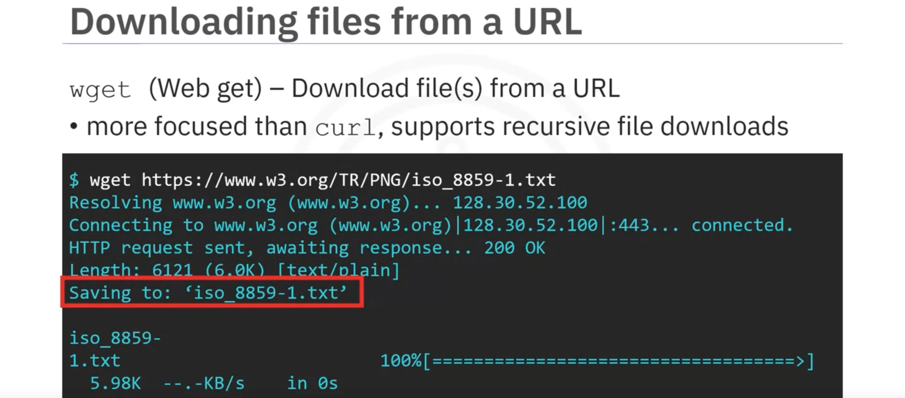
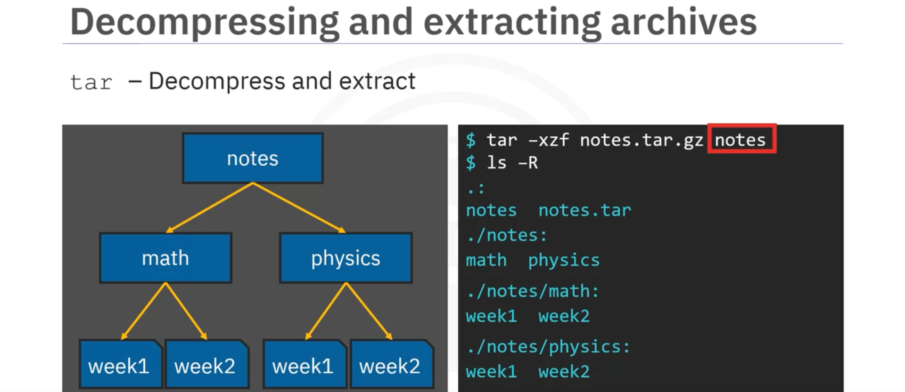

## Module Summary & Highlights

Congratulations! You have completed this module. At this point, you know that:  

A shell is an interactive user interface. You use shell commands to navigate and work with files and directories.

The `curl` and `wget` commands display and download files from URLs, and the`cat` and `tail`commands display file contents.

You can get user information with the `whoami` and `id`commands, and get operating system information using the `uname` command. You can check system disk usage using the `df` command and monitor processes and resource usage with `ps` and `top`.Print string or variable value using `echo`,print and extract information about the date with the `date` command, and read the manual for any command using `man`.

`ls` lists all files and directories within a specified directory tree and `cd` navigates between directories. The `find` command finds files in your directories.

Relative paths are relative to your current working directory, while absolute paths stand independently

You can create files and directories with the `touch` and `mkdir` commands, delete them with `rm` and `rmdir`, and copy and move them `cp` and `mv`.

The `cat`, `more`, `head`, and `tail` commands allow you to sort and view file contents or view only a certain number of lines. Determine line, word, and character counts with `wc`.

You can use `sort` to view the lines of a file alphanumerically and `uniq` to remove repeated lines from your view. `grep` gets the lines of a file that match your desired criteria, and `cut` extracts slices and fields from lines. You can merge lines from different files using `paste`.

`hostname` and `ifconfig` allow you to view the network configuration. You can test a network connection using `ping` and send and receive data using `curl` and `wget`.

Compression preserves storage space, speeds data transfer, and reduces system load.

`zip` compresses files and folders prior to archiving them. `tar` archives and compresses files and directories into a tarball. `unzip` unpacks and decompresses a zipped archive, and `tar` can also decompress and unpack a tar.gz archive.