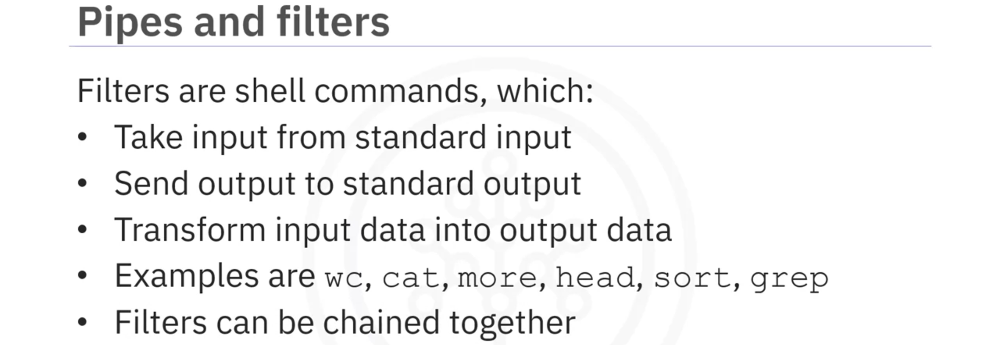

At this point, you know that: 

A shell script is a program that begins with a ‘shebang’ directive and is used to run commands and programs. Scripting languages are interpreted rather than compiled.

Filters are shell commands. The pipe operator `|` allows you to chain filter commands. 

Shell variables can be assigned values with `=` and listed using `set.` Environment variables are shell variables with extended scope, and you can list them with `env.`

Metacharacters are special characters that have meaning to the shell.

Quoting specifies whether the shell should interpret special characters as metacharacters or 'escape' them.

Input/Output, or I/O redirection, refers to a set of features used for redirecting.

You can use command substitution to replace a command with its output.

Command line arguments provide a way to pass arguments to a shell script.

In concurrent mode, multiple commands can run simultaneously.

You can schedule cron jobs to run periodically at selected times. `m h dom mon dow command` is the cron job syntax.

You can edit cron jobs by running `crontab -e,` and `crontab -l` lists all cron jobs in the cron table.